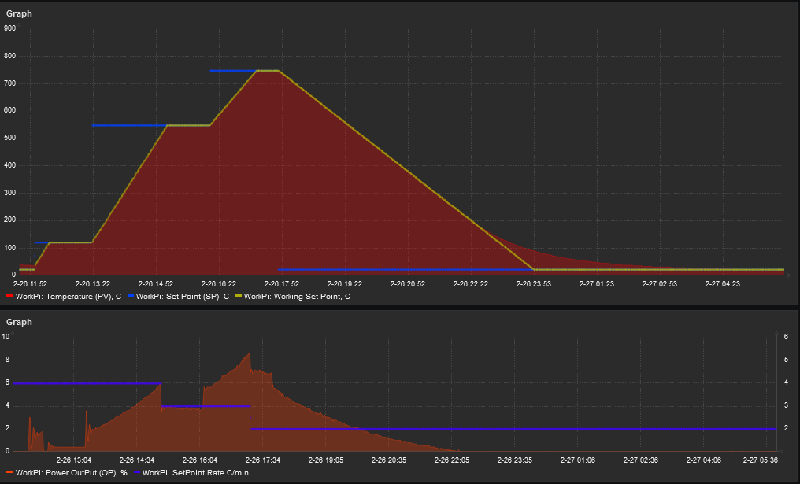

# Eurotherm 3200 Monitoring Gateway


[](https://www.raspberrypi.com/products/raspberry-pi-4-model-b/)
[](https://wiki.radxa.com/Rock4/4cplus)


A lightweight monitoring gateway for **Eurotherm 3200-series temperature controllers** used with laboratory furnaces. The service runs on a Raspberry Pi 4 or Rock 4C+, communicates with the controller through a USB–RS232 adapter, exposes furnace parameters through a small TCP interface, and integrates them with **Zabbix** for remote monitoring.

> **Production use:** this project is actively used in a laboratory environment. The repository therefore favors a small, stable implementation and straightforward deployment over unnecessary application complexity.

## Why this project exists

High-temperature experiments can run for many hours and depend on controlled heating profiles. In our laboratory, furnaces are used for tasks ranging from sample annealing to electrochemical measurements. Power interruptions or unexpected furnace behavior can affect both samples and equipment.

This gateway provides remote visibility into the furnace state so that temperature, set points, heating rate, and controller output can be monitored and recorded in Zabbix. Historical data is useful for diagnosing interrupted or abnormal furnace cycles and deciding how to handle affected experiments.

## Architecture

```text
Eurotherm 3216 temperature controller
              │
           RS-232
              │
       USB–RS232 adapter
              │
   Raspberry Pi 4 / Rock 4C+
              │
     Python + MinimalModbus
              │
       TCP server :9000
              │
       Zabbix Agent 2
              │
        Zabbix Server
              │
      Monitoring dashboard
```

The Python service communicates with the Eurotherm controller and listens for local client requests on TCP port `9000`. Zabbix Agent 2 uses the supplied `UserParameter` configuration and helper script to query the service and expose furnace parameters to the Zabbix server.

## Features

- Communication with Eurotherm 3200-series controllers over serial/Modbus.
- Reading individual controller memory cells.
- Writing controller values when explicitly requested.
- Reading a predefined set of furnace operating parameters.
- Lightweight TCP interface for local integrations.
- Zabbix Agent 2 integration through custom `UserParameter` keys.
- Automatic startup through `systemd`.
- Installation helper for Debian-based single-board computers.
- Tested with Raspberry Pi 4 and Rock 4C+ hardware.

## Technology stack

| Component | Purpose |
| --- | --- |
| Python 3 | Gateway service and Zabbix helper |
| MinimalModbus | Serial/Modbus communication with the controller |
| RS-232 | Physical communication interface |
| Zabbix Agent 2 | Collection of furnace metrics |
| Zabbix Server | Monitoring, history, and visualization |
| systemd | Service lifecycle management |
| Debian Linux | Runtime platform |

## Hardware

The laboratory setup consists of:

- a Eurotherm 3216 temperature controller;
- Raspberry Pi 4 or Rock 4C+ single-board computer;
- USB–RS232 adapter;
- laboratory furnace controlled by the Eurotherm unit.

The current service configuration expects the serial adapter at `/dev/ttyUSB0`, controller address `1`, and a baud rate of `9600`.

## TCP command interface

The service implemented in `main.py` listens on port `9000` and accepts a small command set:

| Command | Description |
| --- | --- |
| `Status` | Health check; returns `Ok` while the service is responsive |
| `Get:<cell>` | Read a controller memory cell |
| `Set:<cell>:<value>` | Write a value to a controller memory cell |
| `Read` | Read the predefined furnace monitoring parameter set |
| `Exit` / `Quit` | Stop the server process |

Controller-specific communication is implemented in `eurotherm3200.py`, while `cls_Server.py` provides the socket server used by the gateway.

## Zabbix integration

The [`Zabbix`](Zabbix) directory contains:

- `eurotherm_user_parameter.conf` — Zabbix Agent 2 `UserParameter` definitions;
- `script_4_zabbix.py` — helper used by Zabbix to query the local gateway.

The configuration exposes the following furnace metrics:

| Zabbix key | Parameter |
| --- | --- |
| `eurotherm_data_pv` | Current furnace/process temperature |
| `eurotherm_data_sp` | Set-point temperature |
| `eurotherm_data_wsp` | Working set point calculated by the controller |
| `eurotherm_data_op` | Furnace power output, % |
| `eurotherm_data_sprate` | Set-point ramp rate |
| `eurotherm_data[*]` | Parameterized access using `-pv`, `-sp`, `-wsp`, `-op`, or `-sprate` |

## Installation

### Automated installation

The repository contains `install.sh`, which installs the required packages, configures Zabbix Agent 2, installs the supplied Zabbix integration files, installs the systemd unit, and starts the services.

Run it from the cloned repository and provide the Zabbix server address:

```bash
sudo bash install.sh <ZABBIX_SERVER_IP>
```

If no address is supplied, the script currently uses `192.168.1.160` as its default Zabbix server address.

On Python installations protected by the PEP 668 `EXTERNALLY-MANAGED` mechanism, the installer handles the required `pip` option. The repository also contains `unlink_externally_managed.sh` as a legacy/helper option for environments where manual intervention is required.

### Manual installation

1. Install Python 3, MinimalModbus, and Zabbix Agent 2.
2. Clone this repository on the single-board computer.
3. Configure `/etc/zabbix/zabbix_agent2.conf` with the Zabbix server address.
4. Copy the files from `Zabbix/` to `/etc/zabbix/zabbix_agent2.d/` and make `script_4_zabbix.py` executable.
5. Copy `systemctl/start-eurotherm.service` to `/etc/systemd/system/`.
6. Reload systemd and start the gateway:

```bash
sudo systemctl daemon-reload
sudo systemctl enable --now start-eurotherm.service
sudo systemctl status start-eurotherm.service
```

7. Restart Zabbix Agent 2:

```bash
sudo systemctl restart zabbix-agent2
sudo systemctl status zabbix-agent2
```

## Project structure

```text
.
├── main.py                 # Main gateway loop and command dispatcher
├── eurotherm3200.py        # Eurotherm controller communication
├── cls_Server.py           # TCP socket server
├── install.sh              # Automated installation/configuration
├── requirements.txt        # Python dependency list
├── systemctl/              # systemd service definition
├── Zabbix/                 # Zabbix UserParameter configuration and helper
└── images/                 # Laboratory setup and monitoring screenshots
```

## Operational notes

This software can issue write commands to a physical temperature controller. In a laboratory deployment, access to TCP port `9000` should therefore be restricted to trusted hosts/networks and the service configuration should be validated against the specific furnace/controller setup before use.

The current implementation intentionally uses fixed serial settings matching the deployed laboratory installation. If the project is adapted to other equipment, verify the serial device, controller address, baud rate, register mapping, and safety limits before enabling write operations.

## Laboratory deployment

### Furnace control unit


### Monitoring an annealing cycle



## Status

The project is actively used for laboratory furnace monitoring. Changes to the runtime code and controller communication should be tested against the target hardware before deployment.