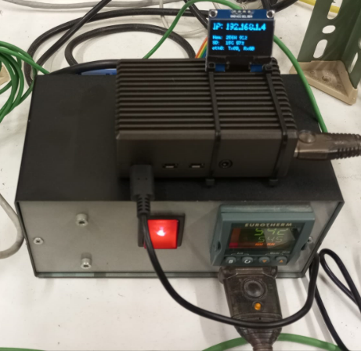
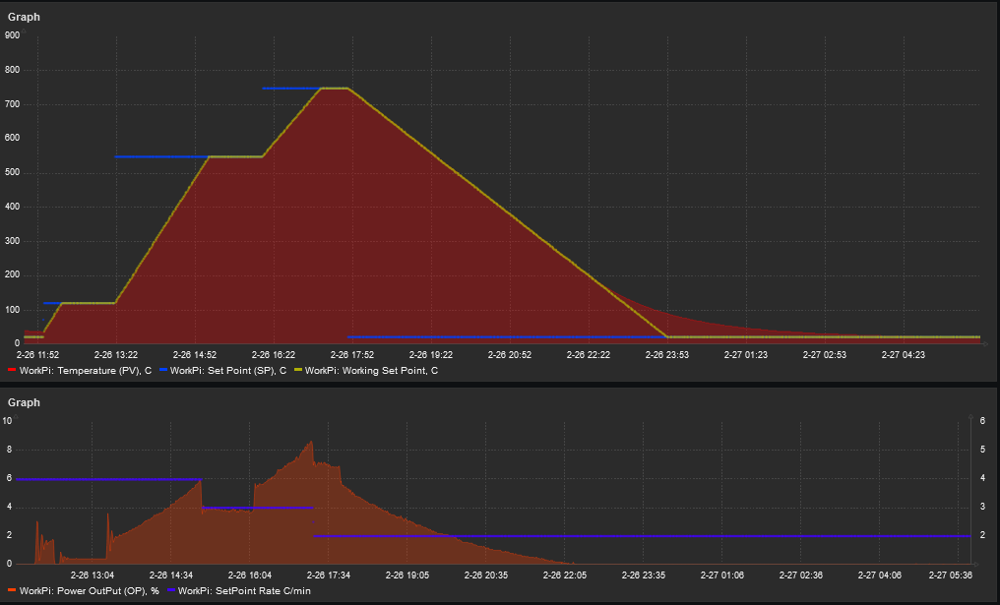

# Server for Eurotherm3200 thermo controller monitoring by Zabbix.


*The project is based on [MinimalModbus](https://github.com/SarathM1/modbus.git) and adapted for 
the Eurotherm 3200 series thermo controller.*

One of the challenges in high-temperature electrochemistry is maintaining strict 
control over the furnace. In our laboratory, we employ various types of furnaces 
for different purposes, ranging from sample annealing to conducting electrochemical 
measurements. The most significant issue we encounter is power interruptions. In such 
instances, obtaining comprehensive information is crucial for making informed 
decisions regarding the preservation of samples and laboratory equipment.

The furnace control unit consist of a [Eurotherm 3216 controller](https://www.eurotherm.com/products/temperature-controllers/single-loop-temperature-controllers/3200-temperature-process-controller/) 
and [Raspberry Pi 4 single-board computer](https://www.raspberrypi.com/products/raspberry-pi-4-model-b/) 
connected via a USB-RS232 adapter. Raspberry Pi works with Debian 1:6.1.73.


## Installation

1. Install [minimalmodbus](https://minimalmodbus.readthedocs.io/en/stable/installation.html)
2. Install Zabbix Agent: ```sudo apt install zabbix-agent2```
3. Configure file */etc/zabbixzabbix_agent2.conf*
4. Clone current repository to your home folder (*/home/pi*)
5. To automatically run the termocontroller server you can copy file 
[start-eurotherm.service](systemctl/start-eurotherm.service) to ```/etc/systemd/system folder```
6. start *start-eurotherm.service*:</br> ```sudo systemctl enable start-eurotherm.service && sudo systemctl start start-eurotherm.service``` 
7. Check ```sudo systemctl status start-eurotherm.service```
8. Copy files from the folder *Zabbix* to ```/etc/zabbix/zabbix_agent2.d``` and 
grant permissions to the file named file *script_4_zabbix.py*.
9. Restart  the service with the command: ```systemctl restart zabbix-agent2``` and 
check its status: ```systemctl status zabbix-agent2```


## Controller part description
In *main.py*, the server loop begins, allowing it to accept incoming connections. </br>
The match-case construction filters the commands from the inlet client based on keywords:

 - ```Exit``` or ```Quit``` to externally stop the program;
 - ```Status``` should simply respond with *Ok* if the program is still alive;
 - ```Get:<cell number>``` will scan a thermo controller memory *cell* and send
a cell value in response;
 - ```Set:<cell number>:<new value>``` will change the value in a thermo controller 
memory *cell*
 - ```Read``` make reading of parameters sequence and send back it's list separated by ```;```.

All interactions with the furnace controller are described in *eurotherm3200.py*</br>
The *SocketServer* class raises a server on port 9000. 

## Zabbix part

The *Zabbix* folder contains files:: 
 - **UserParameter** config (*eurotherm_user_parameter.conf*) 
 - python script (*script_4_zabbix.py*) for **UserParameter**

The eurotherm_user_parameter.conf allows to get data by Zabbix server requests:
 - eurotherm_data_pv- current furnace temperature
 - eurotherm_data_sp- step set point temperature
 - eurotherm_data_wsp- actual working set point (calculated by the controller 
according to the set point rate)
 - eurotherm_data_op- furnace power output in percentage
 - eurotherm_data_sprate- set point rate
 - eurotherm_data[*], here you can use arguments like:
   * -pv
   * -sp
   * -wsp
   * -op
   * -sprate

## Images

 * My The furnace control unit :) </br> 
 * Monitoring the sample annealing furnace cycle </br> 